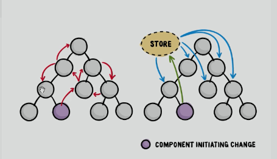
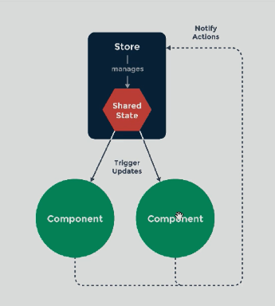

# VuexLearn
学习vue2全家桶中的vuex，为51CTO下的《【玩转Vue】 vuex数据状态管理实战》课程

**多面讲解Vuex在项目开发中的作用，分析vuex的工作流程，通过案例了解其使用方法。**

------

## 01、vuex介绍及在项目的作用

### 介绍Vuex 

> Vuex 是一个专为 Vue.js 应用程序开发的**状态管理模式**。它采用集中式存储管理应用的所有组件的状态，并以相应的规则保证状态以一种可预测的方式发生变化。

#### 状态管理模式：



#### 这个状态自管理应用包含以下几个部分：

- **state**，驱动应用的数据源；
- **view**，以声明方式将 **state** 映射到视图；
- **actions**，响应在 **view** 上的用户输入导致的状态变化。


中央仓库stroe，不同组件间实现数据共享



官网图（https://vuex.vuejs.org/zh/）


### 工作步骤

虚线框内是vuex的基本结构，当一个组件需要操作仓库中的状态时，其步骤为：

1）、发起一个工作请求（Dispatch）到Actions，Actions负责过滤请求，并通过外部的API接口获取数据，请求处理完后，如果是合法的请求就会发送到（Commit）Mutations处理。

2）、Mutations是一种状态修改方法，它可以对中央仓库中的状态（State）进行修改。（Mutations的作用就是加工处理状态并返回一种新的状态）。

3）、当中央仓库中的状态（State）发生改变时，任何引用该状态的组件都会收到vuex更新的通知。

4）、组件接收到状态更改的通知后就会重新渲染该组件视图。


### [安装vuex](https://vuex.vuejs.org/zh/installation.html)

```bash
npm install vuex --save
```

在一个模块化的打包系统中，您必须显式地通过 `Vue.use()` 来安装 Vuex：

把vuex集成到项目中，在main.js文件下写入，当使用全局 script 标签引用 Vuex 时，不需要以上安装过程。

```js
import Vue from "vue"
import Vuex from "vuex"
Vue.use(Vuex)
```


## 02、vuex仓库的结构与工作流

### vuex项目结构

> Vuex 并不限制你的代码结构。但是，它规定了一些需要遵守的规则：
>
> 1. 应用层级的状态应该集中到单个 store 对象中。
> 2. 提交 **mutation** 是更改状态的唯一方法，并且这个过程是同步的。
> 3. 异步逻辑都应该封装到 **action** 里面。
>
> 只要你遵守以上规则，如何组织代码随你便。如果你的 store 文件太大，只需将 action、mutation 和 getter 分割到单独的文件。

项目结构示例：

```bash
├── index.html
├── main.js
├── api
│   └── ... # 抽取出API请求
├── components
│   ├── App.vue
│   └── ...
└── store
    ├── index.js          # 我们组装模块并导出 store 的地方
    ├── actions.js        # 根级别的 action
    ├── mutations.js      # 根级别的 mutation
    └── modules
        ├── cart.js       # 购物车模块
        └── products.js   # 产品模块
```

通过 `store.state` 来获取状态对象，以及通过 `store.commit` 方法触发状态变更：


### vuex核心概念：state


### vuex核心概念：mutations


### vuex核心概念：actions


### vuex核心概念：getters


### vuex核心概念：modules


### vuex辅助函数：mapGetters与计算属性


### vuex辅助函数：mapActions


## 03、vuex实现购物车案例


